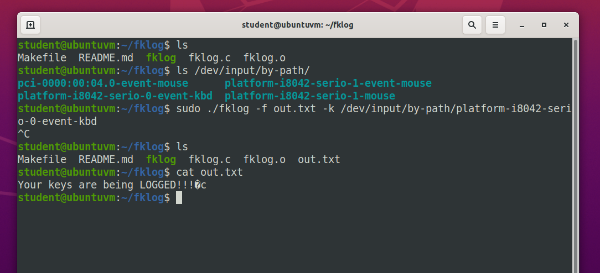

# **fklog**

### **Table of Contents**

* [Summary](#summary)
* [Usage](#usage)
* [Example](#example)
* [Credits](#credits)

### **Summary**

`fklog` is a tool to log textual keystrokes to a file. 

### **Usage**

##### **Compiling**

To compile the program using Make, run `make` from your shell in the directory of the project. 

##### **Running**

To run the program, use `./fklog <options>`. 

The command line options are: 
* [-f | --outfile ] <filename> [Req] – The file to output keystrokes to
* [-k | --keyboard] <filename> [Req] – The file that tracks keyboard events
* [-h | --help    ]            [Opt] – Print help about using `fklog`, then exit

### **Example**

L

### **Credits**

Developer and Creator – Forrest Feaser [@fdfea](https://github.com/fdfea)
